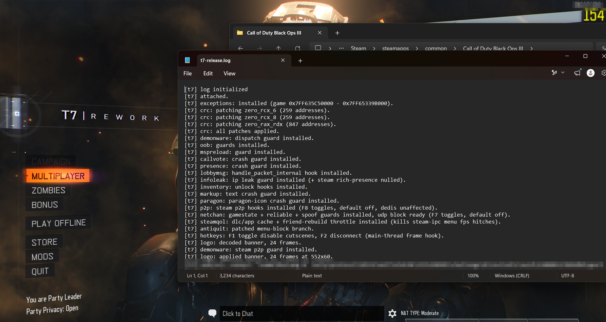

# t7-release

A minimal internal DLL for Call of Duty: Black Ops III (T7), loaded as a `d3d11.dll`
proxy. The focus is protection and quality-of-life: it hardens the client against the
lobby/network crash exploits that plague BO3 and smooths out the worst of the engine's
rough edges. Zero external dependencies, including a from-scratch x64 inline-hook engine.

## About the name

**"T7"** is the community/internal codename for Black Ops III — it stands for **Treyarch 7**,
i.e. Treyarch's seventh Call of Duty title. It's just shorthand for the game, nothing more.

**This project ("t7-release") is not affiliated with, based on, or related to "T7 Patch"**
(or any other similarly named tool). Different authors, different codebase, different goals —
the shared "t7" simply refers to the same game. Don't confuse the two.

## Verified

Running on a live Black Ops III process — every module initializes and every inline hook
lands cleanly (no `undecodable prologue` failures), all placed by the in-house x64 hook
engine. The `oob(sv): connect` line at the bottom is the guard filtering real inbound
connection traffic in real time.



## Features

Every string in the binary is RC4-encrypted at compile time (per-string unique key), so
the strings view of a dumped build is empty.

**Server-command RCE / kick guards** (`servercmd`)

Every host→client server command is validated before the game processes it (and logged for review):

- `/` command — clamps the entity index; the game had none, so an out-of-range index read a pointer out of bounds and **wrote through it** = remote code execution.
- `7` command — clamps the team/entity indices to stop a remote out-of-bounds write.
- message commands (`)` `<` `;` `O`) — routes the formatter through a large scratch buffer to stop a `[{...}]`-token stack overflow.
- `D` command — bounds the arg-count and rate-limits the opcode; it sets a LUI data-model and notifies every subscriber, so a host flooding it exhausts the LUI element pool = **client crash** (`Failed to allocate from element pool`).
- kick immunity — neutralizes the host-triggered forced-disconnects: bad configstring index, 64 KB configstring-pool overflow, big-configstring reassembly overflow, reliable-sequence cycle-out, and the BG-cache checksum mismatch (configstring 3241).

**Crash / exploit guards**

- `workshop` — drops host-forced Steam Workshop UGC, killing the phantom-DLL sideload RCE (a mod shipping `RzChromaSDK64.dll` / `atiadlxx.dll` that loads onto everyone in the lobby).
- `demonware` — drops malicious demonware + Steam-P2P instant messages (remote popup / remote cbuf).
- `oob` — filters connectionless out-of-band commands (rcon, mstart, relay, ...).
- `lobbymsg` — bounds-checks and validates lobby message deserialization (array overflow, spoofed sender, voice-packet OOB, forged kicks).
- `netchan` — gamestate + reliable-ack + packet-spoof guards on the netchannel layer.
- `markup` — defuses the `^`-code text parser crash surface.
- `mspreload` — blocks the forced side-load (`mspreload` / `msload`) crash.
- `callvote` — clamps and sanitizes oversized vote strings.
- `presence` — clamps the LivePresence player count to stop the serialize overflow.
- `paragon` — guards the malformed paragon-icon scoreboard lookup.
- `menu` — de-dupes repeated `OpenMenu` calls, killing the GSC pause-menu spam crash that exhausts the LUI element pool.

**Privacy**

- `infoleak` — blocks raw-UDP to non-host endpoints and nulls Steam rich presence, so your IP isn't handed out to the lobby.
- `presence` — hides your rich presence from non-friends.
- `video` — blocks host-forced `http://` / `https://` video loads (IP-leak deanon + a remote video-decoder attack surface).

**Quality of life**

- `video` — F1 skips in-game cutscenes (hooks the cinematic loader so they never start; menu backgrounds are untouched).
- `steamqol` — caches DLC/app install queries and throttles the friend-list rebuild, killing the Steam-IPC menu FPS hitches.
- `antiquit` — clears the forced menu-block branch.
- `logo` — animated frontend banner from an embedded resource.

**Unlocks**

- `inventory` — reports owned quantities / purchased slots for cosmetic items.

## Hotkeys

| Key | Action |
| --- | --- |
| F1  | Toggle disable cutscenes (while in a game; menu backgrounds are unaffected) |
| F2  | Disconnect from the current session |
| F7  | Toggle raw-UDP block (breaks dedi / direct connect while on) |
| F8  | Toggle Steam-P2P block (raw-UDP dedis still work while on) |

## Build

Requires Visual Studio with the C++ x64 toolchain.

```
build.bat
```

The script sets up `vcvars64`, generates the proxy export forwarders, compiles the DLL
(with the in-house hook engine — no third-party libraries), and writes
`build\bin\t7-release.dll`. On success it auto-deploys to your Black Ops III install
(located via the Steam registry) as `d3d11.dll`.

## Install

Drop the built `d3d11.dll` next to `BlackOps3.exe` in your game directory. The game loads
it from its own folder before the system copy; the proxy forwards every real `d3d11`
export on to `C:\Windows\System32\d3d11.dll`, so rendering is unaffected.

At runtime it writes to a `t7-rework` folder next to the game:

```
t7-rework/
  logs/            t7-release.log (startup + per-frame activity)
  exceptions/      exception-<date>.txt (one file per fault)
```

## Reporting crashes

If the DLL faults it drops a full dump — code, faulting address, registers, and a
stack walk — into `t7-rework/exceptions/exception-<date>.txt`. **Please post that file
in the Discord so it can be reviewed and fixed:** https://discord.gg/WWKZsCCesT

## Layout

```
src/
  dllmain.cpp        entry point + init/tick loop
  engine/            game offsets and typed wrappers
  patches/           one folder per feature module
  features/          non-patch features (logo)
  utils/             crypt (string encryption), hook (x64 inline-hook engine), log, mem, resource, exceptions
  proxy/             generated d3d11 export forwarders
tools/               gen_proxy.ps1, deploy.ps1
data/                embedded resources + crc patch blobs
```

## Hook engine

`utils/hook` is a self-contained x64 inline hooker — no third-party library. It length-
decodes the target prologue, relocates the stolen bytes to a trampoline allocated within
±2 GB (fixing RIP-relative operands and rel32 branches), and installs a 14-byte absolute
jmp. `attach(&original, detour)` redirects the function and rewrites `original` to point
at the trampoline; `detach(target)` restores the original bytes.
